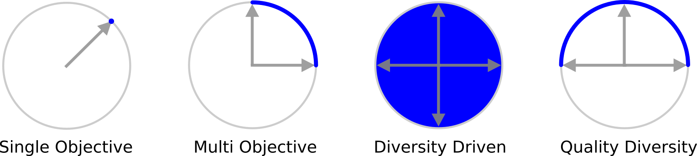
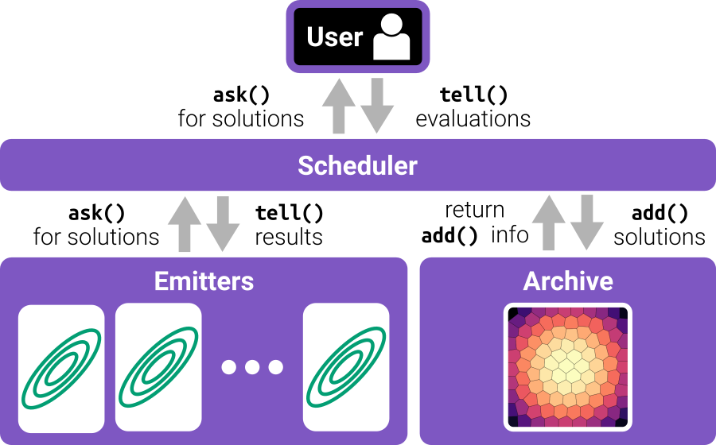
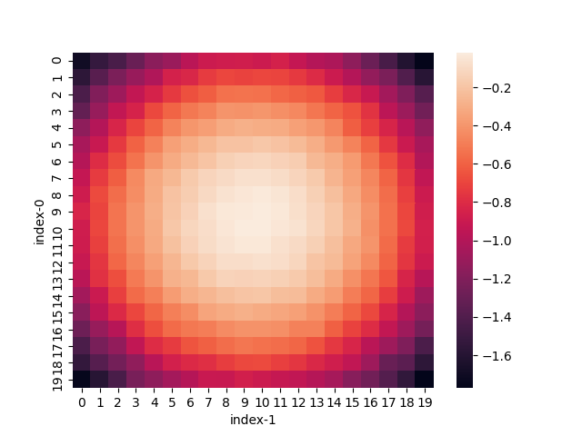

# pyribs

|             Website              |                     Source                     |                    Docs                    |                    Paper                     |                                                                   Twitter                                                                    |
| :------------------------------: | :--------------------------------------------: | :----------------------------------------: | :------------------------------------------: | :------------------------------------------------------------------------------------------------------------------------------------------: |
| [pyribs.org](https://pyribs.org) | [GitHub](https://github.com/icaros-usc/pyribs) | [docs.pyribs.org](https://docs.pyribs.org) | [pyribs.org/paper](https://pyribs.org/paper) | [](https://twitter.com/pyribs) |

|                                                       PyPI                                                        |                                                               Conda                                                                |                                                                                                      CI/CD                                                                                                       |                                                                   Docs Status                                                                    |
| :---------------------------------------------------------------------------------------------------------------: | :--------------------------------------------------------------------------------------------------------------------------------: | :--------------------------------------------------------------------------------------------------------------------------------------------------------------------------------------------------------------: | :----------------------------------------------------------------------------------------------------------------------------------------------: |
| [](https://pypi.python.org/pypi/ribs) | [](https://anaconda.org/conda-forge/pyribs) | [](https://github.com/icaros-usc/pyribs/actions?query=workflow%3A"Tests") | [](https://readthedocs.org/projects/ribs/) |

A _bare-bones_ Python library for quality diversity (QD) optimization. Pyribs
implements the highly modular _Rapid Illumination of Behavior Space (RIBS)_
framework for QD optimization. Pyribs is also the official implementation of
Covariance Matrix Adaptation MAP-Elites (CMA-ME), Covariance Matrix Adaptation
MAP-Elites via a Gradient Arborescence (CMA-MEGA), Covariance Matrix Adaptation
MAP-Annealing (CMA-MAE), and scalable variants of CMA-MAE.

## Overview



[Quality diversity (QD) optimization](https://arxiv.org/abs/2012.04322) is a
subfield of optimization where solutions generated cover every point in a
_measure_ space while simultaneously maximizing (or minimizing) a single
_objective_. QD algorithms within the MAP-Elites family of QD algorithms produce
heatmaps (archives) as output where each cell contains the best discovered
representative of a region in measure space.

> In the QD literature, measure function outputs have also been referred to as
> "behavioral characteristics," "behavior descriptors," or "feature
> descriptors."

Recent years have seen the development of a large number of QD algorithms. To
represent these and future algorithms, we have developed the highly modular RIBS
framework. RIBS divides a QD algorithm into three components:

- An **archive**, which saves generated solutions within measure space.
- One or more **emitters**, where each emitter is an algorithm which generates
  new candidate solutions and responds to feedback about how the solutions were
  evaluated and how they were inserted into the archive.
- A **scheduler** which controls the interaction of the **archive** and
  **emitters**. The **scheduler** also provides an interface for requesting new
  candidate solutions and telling the algorithm how candidates performed.

By interchanging these components, a user can compose a large number of QD
algorithms.

Pyribs is an implementation of the RIBS framework designed to support a wide
range of users, from beginners entering the field to experienced researchers
seeking to develop new algorithms. Pyribs achieves these goals by embodying
three principles:

- **Simple:** Centered _only_ on components that are absolutely necessary to run
  a QD algorithm, allowing users to combine the framework with other software
  frameworks.
- **Flexible:** Capable of representing a wide range of current and future QD
  algorithms, allowing users to easily create or modify components.
- **Accessible:** Easy to install and learn, particularly for beginners with
  limited computational resources.

In contrast to other QD libraries, pyribs is "bare-bones." For example, like
[pycma](https://pypi.org/project/cma/), pyribs focuses solely on optimizing
fixed-dimensional continuous domains. Focusing on this one commonly-occurring
problem allows us to optimize the library for performance as well as ease of
use. Refer to the list of [additional QD libraries](#additional-qd-libraries)
below if you need greater performance or have additional use cases.

Following the RIBS framework (shown in the figure below), a standard algorithm
in pyribs operates as follows:

1. The user calls the `ask()` method on the scheduler. The scheduler requests
   solutions from each emitter by calling the emitter's `ask()` method.
2. The user evaluates solutions to obtain the objective and measure values.
3. The user passes the evaluations to the scheduler's `tell()` method. The
   scheduler adds the solutions into the archive and receives feedback. The
   scheduler passes this feedback along with the evaluated solutions to each
   emitter's `tell()` method, and each emitter then updates its internal state.



## Paper

Two years after the initial release of pyribs, we released a paper which
elaborates on the RIBS framework and the design decisions behind pyribs! For
more information on this paper, see [here](https://pyribs.org/paper).

## Citation

If you use pyribs in your research, please cite it as follows. Note that you
will need to include the
[hyperref](https://www.overleaf.com/learn/latex/Hyperlinks#Linking_web_addresses)
package in order to use the `\url` command. Also consider citing any algorithms
you use as shown [below](#citing-algorithms-in-pyribs).

```
@misc{pyribs,
  title={pyribs: A Bare-Bones Python Library for Quality Diversity Optimization},
  author={Bryon Tjanaka and Matthew C. Fontaine and David H. Lee and Yulun Zhang and Nivedit Reddy Balam and Nathaniel Dennler and Sujay S. Garlanka and Nikitas Dimitri Klapsis and Stefanos Nikolaidis},
  year={2023},
  eprint={2303.00191},
  archivePrefix={arXiv},
  primaryClass={cs.NE}
}
```

## Usage

Here we show an example application of CMA-ME in pyribs. To initialize the
algorithm, we first create:

- A 2D **GridArchive** where each dimension contains 20 cells across the range
  [-1, 1].
- Three instances of **EvolutionStrategyEmitter**, all of which start from the
  search point **0** in 10-dimensional space and a Gaussian sampling
  distribution with standard deviation 0.1.
- A **Scheduler** that combines the archive and emitters together.

After initializing the components, we optimize (pyribs maximizes) the negative
10-D Sphere function for 1000 iterations. Users of
[pycma](https://pypi.org/project/cma/) will be familiar with the ask-tell
interface (which pyribs adopted). First, the user must `ask` the scheduler for
new candidate solutions. After evaluating the solution, they `tell` the
scheduler the objectives and measures of each candidate solution. The algorithm
then populates the archive and makes decisions on where to sample solutions
next. Our toy example uses the first two parameters of the search space as
measures.

```python
import numpy as np

from ribs.archives import GridArchive
from ribs.emitters import EvolutionStrategyEmitter
from ribs.schedulers import Scheduler

archive = GridArchive(
    solution_dim=10,
    dims=[20, 20],
    ranges=[(-1, 1), (-1, 1)],
)
emitters = [
    EvolutionStrategyEmitter(
        archive,
        x0=[0.0] * 10,
        sigma0=0.1,
    ) for _ in range(3)
]
scheduler = Scheduler(archive, emitters)

for itr in range(1000):
    solutions = scheduler.ask()

    # Optimize the 10D negative Sphere function.
    objective_batch = -np.sum(np.square(solutions), axis=1)

    # Measures: first 2 coordinates of each 10D solution.
    measures_batch = solutions[:, :2]

    scheduler.tell(objective_batch, measures_batch)
```

To visualize this archive with Matplotlib, we then use the
`grid_archive_heatmap` function from `ribs.visualize`.

```python
import matplotlib.pyplot as plt
from ribs.visualize import grid_archive_heatmap

grid_archive_heatmap(archive)
plt.show()
```



For more information, refer to the [documentation](https://docs.pyribs.org/).

## Installation

pyribs supports Python 3.7 and above. Earlier Python versions may work but are
not officially supported. To find the installation command for your system
(including for installing from source), visit the
[installation selector](https://pyribs.org/#installation) on our website.

To test your installation, import pyribs and print the version with this
command:

```bash
python -c "import ribs; print(ribs.__version__)"
```

You should see a version number in the output.

## Documentation

See here for the documentation: <https://docs.pyribs.org>

To serve the documentation locally, clone the repo and install the development
requirements with

```bash
pip install -e .[dev]
```

Then run

```bash
make servedocs
```

This will open a window in your browser with the documentation automatically
loaded. Furthermore, every time you make changes to the documentation, the
preview will also reload.

## Contributors

pyribs is developed and maintained by the [ICAROS Lab](http://icaros.usc.edu) at
USC. For information on contributing to the repo, see
[CONTRIBUTING](./CONTRIBUTING.md).

- [Bryon Tjanaka](https://btjanaka.net)
- [Matthew C. Fontaine](https://scholar.google.com/citations?user=RqSvzikAAAAJ)
- [David H. Lee](https://github.com/itsdawei)
- [Yulun Zhang](https://github.com/lunjohnzhang)
- [Nivedit Reddy Balam](https://www.linkedin.com/in/nivedit-reddy)
- [Nathan Dennler](https://ndennler.github.io/)
- [Sujay S. Garlanka](https://sujaygarlanka.com)
- Nikitas Klapsis
- [Robby Costales](https://robbycostales.com)
- [Sam Sommerer](https://github.com/sam-sommerer)
- [Vincent Vu](https://vuvincent.com/)
- [Stefanos Nikolaidis](https://stefanosnikolaidis.net)

We thank [Amy K. Hoover](http://amykhoover.com/) and
[Julian Togelius](http://julian.togelius.com/) for their contributions deriving
the CMA-ME algorithm.

## Users

pyribs users include:

<!-- Alphabetical order -->

- [Adam Gaier (Autodesk Research)](https://scholar.google.com/citations?user=GGyARB8AAAAJ)
- [Adaptive & Intelligent Robotics Lab (Imperial College London)](https://www.imperial.ac.uk/adaptive-intelligent-robotics)
- [Chair of Statistical Learning and Data Science (LMU Munich)](https://www.slds.stat.uni-muenchen.de/)
- [Game Innovation Lab (New York University)](https://game.engineering.nyu.edu)
- [Giovanni Iacca (University of Trento)](https://sites.google.com/site/giovanniiacca/)
- [HUAWEI Noah's Ark Lab](https://github.com/huawei-noah)
- [ICAROS Lab (University of Southern California)](http://icaros.usc.edu/)
- [Jacob Schrum (Southwestern University)](https://github.com/schrum2/PyribsForGameGAN)
- [Lenia Research](https://lenia.world)
- [Paul Kent (The University of Warwick)](https://warwick.ac.uk/fac/sci/mathsys/people/students/2018intake/kent/)
- [Various](https://github.com/ganyariya/mario_pytorch)
  [researchers](https://direct.mit.edu/isal/proceedings/isal/33/112256) at the
  University of Tsukuba

### Publications

For the list of publications which use pyribs, refer to our
[Google Scholar entry](https://scholar.google.com/scholar?oi=bibs&hl=en&cites=16246392515630874608).

### Software

See the
[GitHub dependency graph](https://github.com/icaros-usc/pyribs/network/dependents)
for the public GitHub repositories which depend on pyribs.

## Citing Algorithms in pyribs

If you use the following algorithms, please also cite their relevant papers:

- **CMA-ME:** [Fontaine 2020](https://dl.acm.org/doi/10.1145/3377930.3390232)
  ```
  @inproceedings{10.1145/3377930.3390232,
    author = {Fontaine, Matthew C. and Togelius, Julian and Nikolaidis, Stefanos and Hoover, Amy K.},
    title = {Covariance Matrix Adaptation for the Rapid Illumination of Behavior Space},
    year = {2020},
    isbn = {9781450371285},
    publisher = {Association for Computing Machinery},
    address = {New York, NY, USA},
    url = {https://doi.org/10.1145/3377930.3390232},
    doi = {10.1145/3377930.3390232},
    booktitle = {Proceedings of the 2020 Genetic and Evolutionary Computation Conference},
    pages = {94–102},
    numpages = {9},
    location = {Canc\'{u}n, Mexico},
    series = {GECCO '20}
  }
  ```
- **CMA-MEGA:**
  [Fontaine 2021](https://proceedings.neurips.cc/paper/2021/hash/532923f11ac97d3e7cb0130315b067dc-Abstract.html)
  ```
  @inproceedings{NEURIPS2021_532923f1,
   author = {Fontaine, Matthew and Nikolaidis, Stefanos},
   booktitle = {Advances in Neural Information Processing Systems},
   editor = {M. Ranzato and A. Beygelzimer and Y. Dauphin and P.S. Liang and J. Wortman Vaughan},
   pages = {10040--10052},
   publisher = {Curran Associates, Inc.},
   title = {Differentiable Quality Diversity},
   url = {https://proceedings.neurips.cc/paper/2021/file/532923f11ac97d3e7cb0130315b067dc-Paper.pdf},
   volume = {34},
   year = {2021}
  }
  ```
- **CMA-MAE:** [Fontaine 2022](https://arxiv.org/abs/2205.10752)
  ```
  @misc{cmamae,
    doi = {10.48550/ARXIV.2205.10752},
    url = {https://arxiv.org/abs/2205.10752},
    author = {Fontaine, Matthew C. and Nikolaidis, Stefanos},
    keywords = {Machine Learning (cs.LG), Artificial Intelligence (cs.AI), FOS: Computer and information sciences, FOS: Computer and information sciences},
    title = {Covariance Matrix Adaptation MAP-Annealing},
    publisher = {arXiv},
    year = {2022},
    copyright = {arXiv.org perpetual, non-exclusive license}
  }
  ```
- **Scalable CMA-MAE:** [Tjanaka 2022](https://arxiv.org/abs/2210.02622)
  ```
  @misc{scalablecmamae,
        title={Training Diverse High-Dimensional Controllers by Scaling Covariance Matrix Adaptation MAP-Annealing},
        author={Bryon Tjanaka and Matthew C. Fontaine and Aniruddha Kalkar and Stefanos Nikolaidis},
        year={2022},
        eprint={2210.02622},
        archivePrefix={arXiv},
        primaryClass={cs.RO}
  }
  ```

## Additional QD Libraries

- [QDax](https://github.com/adaptive-intelligent-robotics/QDax): Implementations
  of QD algorithms in JAX. QDax is suitable if you want to run entire QD
  algorithms on hardware accelerators in a matter of minutes, and it is
  particularly useful if you need to interface with Brax environments.
- [qdpy](https://gitlab.com/leo.cazenille/qdpy/): Python implementations of a
  wide variety of QD algorithms.
- [sferes](https://github.com/sferes2/sferes2): Contains C++ implementations of
  QD algorithms; can also handle discrete domains.

## License

pyribs is released under the
[MIT License](https://github.com/icaros-usc/pyribs/blob/master/LICENSE).

## Credits

The pyribs package was initially created with
[Cookiecutter](https://github.com/audreyr/cookiecutter) and the
[audreyr/cookiecutter-pypackage](https://github.com/audreyr/cookiecutter-pypackage)
project template.
