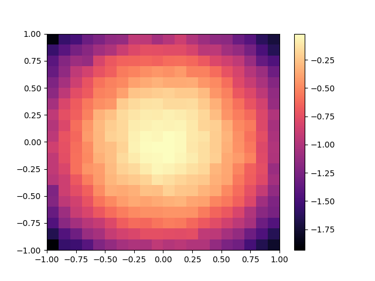

# pyribs

|                     Source                     |                                                       PyPI                                                        |                                                                                                                  CI/CD                                                                                                                   |                        Docs                        |                                                                   Docs Status                                                                    |
| :--------------------------------------------: | :---------------------------------------------------------------------------------------------------------------: | :--------------------------------------------------------------------------------------------------------------------------------------------------------------------------------------------------------------------------------------: | :------------------------------------------------: | :----------------------------------------------------------------------------------------------------------------------------------------------: |
| [GitHub](https://github.com/icaros-usc/pyribs) | [](https://pypi.python.org/pypi/ribs) | [](https://github.com/icaros-usc/pyribs/actions?query=workflow%3A"Automated+Testing") | [ribs.readthedocs.io](https://ribs.readthedocs.io) | [](https://readthedocs.org/projects/ribs/) |

A _bare-bones_ quality diversity optimization library. This library is the
official reference implementation of the Covariance Matrix Adaptation MAP-Elites
algorithm and implements the _Rapid Illumination of Behavior Spaces (RIBS)_
redesign of MAP-Elites (CMA-ME) detailed in the paper
[Covariance Matrix Adapation for the Rapid Illumination of Behavior Space](https://arxiv.org/abs/1912.02400).

## Overview


Quality-diversity (QD) optimization is a subfield of optimization where
solutions generated cover every point in a behavior space while simultaneously
maximizing (or minimizing) a single objective. QD algorithms within the
MAP-Elites family of QD algorithms produce heatmaps (archives) as output where
each cell contains the best discovered representative of a region in behavior
space.

While many QD libraries exist, this particular library aims to be the QD analog
to the [pycma](https://pypi.org/project/cma/) library (a single objective
optimization library). In contrast to other libraries, this library is
"bare-bones" and (like [pycma](https://pypi.org/project/cma/)) focuses solely on
optimizing fixed dimensional continuous domains. Focusing solely on this one
commonly occurring problem allows us to optimize the library for performance as
well as simplicity of use. QD algorithms are used extensively in neuroevolution
research and applications. For a QD library which implements augmenting
topologies or other complex operations beyond the scope of this library, we
recommend referring to [qdpy](https://gitlab.com/leo.cazenille/qdpy/) or
[sferes](https://github.com/sferes2/sferes2).

TODO

- The **Archive** stores solutions found by the algorithm so far.
- **Emitters** (one or more) take the archive and decide how to generate new
  solutions from it.
- An **Optimizer** joins the algorithm together. The optimizer repeatedly
  generates solutions from the archive using the emitters, and adds the
  evaluated solutions back into the archive.

## Usage Example

pyribs uses an ask-tell interface similar to that of
[pycma](https://pypi.org/project/cma/). The following example shows how to run
the RIBS version of MAP-Elites. Specifically, we create:

- A 2D **GridArchive** with 20 bins and a range of (-1, 1) in each dimension.
- A **GaussianEmitter**, which in this case starts by drawing solutions from a
  Gaussian distribution centered at **0** with standard deviation 0.1. After the
  first iteration, this emitter selects random solutions in the archive and adds
  Gaussian noise to it with standard deviation 0.1.
- An **Optimizer** that combines the archive and emitter together.

After creating the components, we then run on the negative 10-D Sphere function
for 1000 iterations. For simplicity, the BCs are the first two entries of each
10D solution vector.

```python
import numpy as np

from ribs.archives import GridArchive
from ribs.emitters import GaussianEmitter
from ribs.optimizers import Optimizer

archive = GridArchive([20, 20], [(-1, 1), (-1, 1)])
emitters = [GaussianEmitter(archive, [0.0] * 10, 0.1)]
optimizer = Optimizer(archive, emitters)

for itr in range(1000):
    solutions = optimizer.ask()

    objectives = -np.sum(np.square(solutions), axis=1)
    bcs = solutions[:, :2]

    optimizer.tell(objectives, bcs)
```

To visualize this archive with matplotlib, we can then use the
`grid_archive_heatmap` function from `ribs.visualize`.

```python
import matplotlib.pyplot as plt
from ribs.visualize import grid_archive_heatmap

grid_archive_heatmap(archive)
plt.show()
```



For more information, please refer to the
[documentation](https://ribs.readthedocs.io/).

## Installation

pyribs supports Python 3.6 and greater. Earlier versions may work but are not
officially supported.

To install from PyPI, run

```bash
pip install ribs
```

This command only installs dependencies for the core of pyribs. To be able to
use tools like `ribs.visualize`, run

```bash
pip install ribs[all]
```

To install a version from source, clone this repo, cd into it, and run

```bash
pip install -e .[all]
```

To test your installation, import it and print the version with:

```bash
python -c "import ribs; print(ribs.__version__)"
```

You should see a version number like `0.2.0` in the output.

## Documentation

See here for the documentation: <https://ribs.readthedocs.io>

To serve the documentation locally, clone the repo and install the development
requirements with

```bash
pip install -e .[dev]
```

Then run

```bash
make servedocs
```

This will open a window in your browser with the documentation automatically
loaded. Furthermore, every time you make changes to the documentation, the
preview will also reload.

## Contributors

This project was completed in the [ICAROS Lab](http://icaros.usc.edu) at USC.

- [Bryon Tjanaka](https://btjanaka.net)
- [Matt Fontaine](https://github.com/tehqin)
- [Yulun Zhang](https://github.com/lunjohnzhang)
- [Sam Sommerer](https://github.com/sam-som-usc)
- Nikitas Klapsis
- [Stefanos Nikolaidis](https://stefanosnikolaidis.net)

## License

pyribs is released under the
[MIT License](https://github.com/icaros-usc/pyribs/blob/master/LICENSE).

## Credits

This package was initially created with
[Cookiecutter](https://github.com/audreyr/cookiecutter) and the
[audreyr/cookiecutter-pypackage](https://github.com/audreyr/cookiecutter-pypackage)
project template.
